# <h1 align="center">Portfólio QA – Testes de API com Postman (JSONPlaceholder) 👨🏻‍💻 

Este projeto faz parte do meu portfólio de **Quality Assurance (QA)** e demonstra
o uso do **Postman** para testes de API.  
Utilizei a API pública [JSONPlaceholder](https://jsonplaceholder.typicode.com) 
para criar e validar cenários de **CRUD** (Create, Read, Update, Delete).

## 📌 O que foi feito
- CRUD completo em **/users** e **/posts**
- Validação de status code, formato JSON e tempo de resposta
- Testes automáticos de campos obrigatórios (id, name, email)
- Encadeamento de variáveis (userId, postId, commentId)
- Exemplos salvos (200, 201, 404) para documentação

## 🚀 Como usar no Postman
1. Baixe os arquivos da pasta `collections/` e `environments/`.
2. Importe no Postman:
   - Collection: `JSONPlaceholder.postman_collection.json`
   - Environment: `QA Tests – JSONPlaceholder.postman_environment.json`
3. Selecione o Environment no topo do Postman.
4. Execute as requisições na ordem CRUD.

```mermaid

flowchart LR
    A["GET /users - 📋 Lista todos os usuários"]:::get --> B["GET /users/:id - 🔎 Detalha um usuário específico"]:::get
    B --> C["POST /users - ➕ Cria novo usuário"]:::post
    C --> D["PUT /users/:id - ✏️ Atualiza todos os dados"]:::put
    D --> E["PATCH /users/:id - 🛠 Atualiza alguns campos"]:::patch
    E --> F["DELETE /users/:id - 🗑 Remove o usuário (simulado)"]:::delete

classDef get fill:#22c55e,stroke:#166534,stroke-width:2px,color:white;
classDef post fill:#3b82f6,stroke:#1e3a8a,stroke-width:2px,color:white;
classDef put fill:#eab308,stroke:#92400e,stroke-width:2px,color:black;
classDef patch fill:#f97316,stroke:#7c2d12,stroke-width:2px,color:white;
classDef delete fill:#ef4444,stroke:#7f1d1d,stroke-width:2px,color:white;
```

## <h1 align="center">🔄 Fluxo do CRUD – Usuários

## <h1 align="center">📊 Estatísticas

### 👤 Perfil GitHub

---

### 📂 Este Repositório

---

### <h1 align="center">📈 Gráfico de Contribuições

<h1 align="center">

